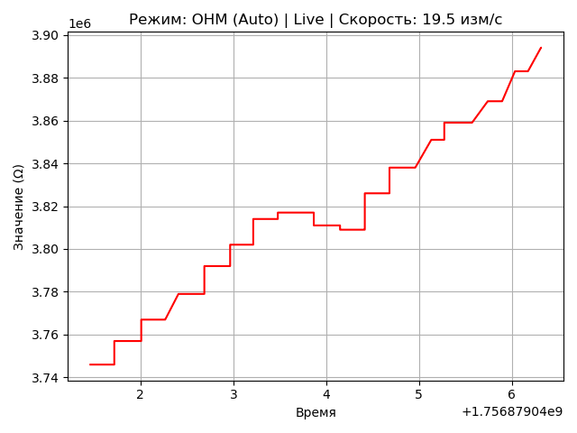

# unit_ut61eplus_python
Implementation of the UNI-T UT61E+ Communication Protocol in Python

https://github.com/ljakob/unit_ut61eplus

## Simple examples
* single point measurment
* multiple point measurment
* log data to csv
* send command

## Realtime plot
This example shows how to create a plot that updates in real time.




# Output data
``` Python
{'value': VALUE, 'unit': UNIT, 'mode': MODE, 'range': 'AUTO'|'MANUAL', 'overload': True|False, 'hold': True|False, 'min_max': None|'max'|'min'|'p-max'|'p-min, 'rel': True|False, 'hv_warning': True|False, 'True|False': False}
```
# Reference
* [ljakob/unit_ut61eplus](https://github.com/ljakob/unit_ut61eplus)